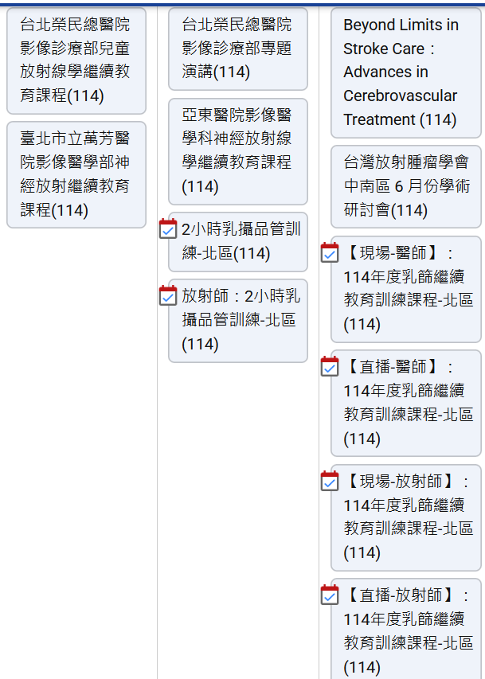
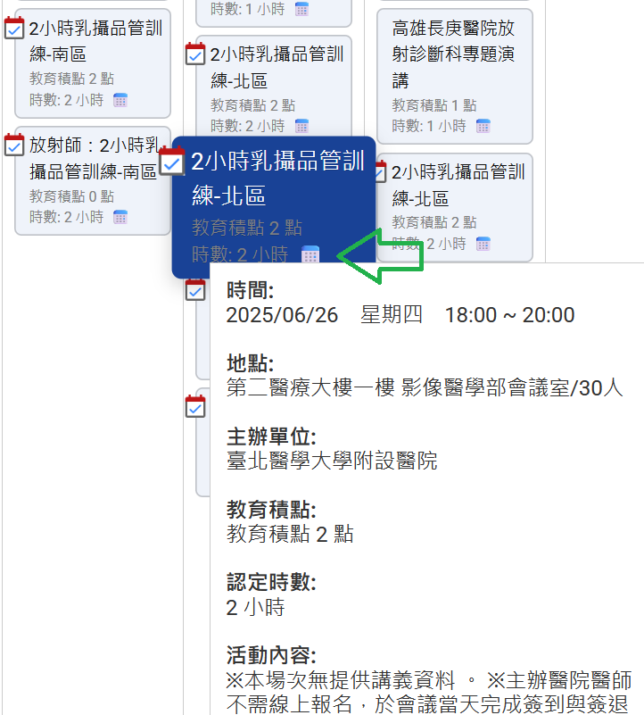
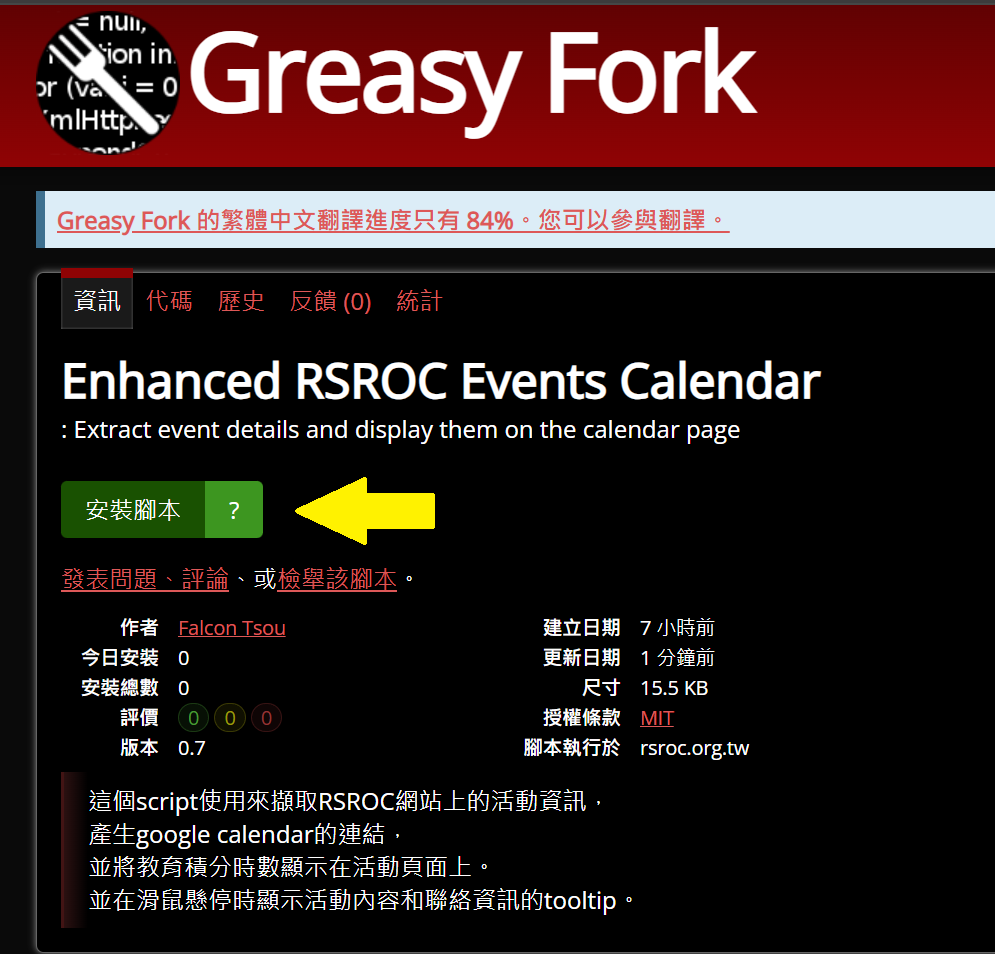

# Enhanced RSROC Events Calendar

這個腳本旨在提升RSROC中華民國放射線醫學會網站上的活動日曆體驗，提供更豐富的活動資訊和便捷的Google日曆整合功能。

## 功能

這個script使用來擷取RSROC網站上的活動資訊，並提供以下增強功能：
 - **Google 日曆整合**: 點擊活動旁的📅小日曆圖案，即可快速將活動加入您的Google日曆。
 - **教育積分時數顯示**: 在活動頁面直接顯示教育積分時數，方便快速查閱。
 - **詳細資訊懸停提示**: 將滑鼠懸停在活動上時，會顯示包含詳細活動內容和聯絡資訊的提示框。

<table>
  <tr valign="top">
    <td>
      <h3>Before</h3>
      
    </td>
    <td>
      <h3>After</h3>
      
    </td>
  </tr>
</table>

## 安裝

1. 安裝 [篡改猴 Tampermonkey](https://chromewebstore.google.com/detail/%E7%AF%A1%E6%94%B9%E7%8C%B4/dhdgffkkebhmkfjojejmpbldmpobfkfo)  的Chrome擴充功能，Safari 使用者可以選擇安裝 [Tampermonkey](https://apps.apple.com/tw/app/tampermonkey/id6738342400) 或 [Userscripts](https://apps.apple.com/tw/app/userscripts/id1463298887)。

2. 安裝 [Enhanced RSROC Events Calendar](https://greasyfork.org/zh-TW/scripts/537049-enhanced-rsroc-events-calendar) 腳本
  - 進greasy fork直接按下**安裝腳本**就可以
    
  - 或是直接將 userscript-rsroc.js 貼到**新增腳本**裡  
    

  

## 授權
本專案採用 MIT 授權條款。詳情請參閱 LICENSE 檔案。
